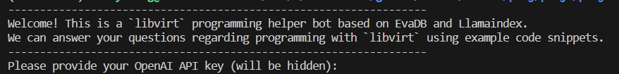
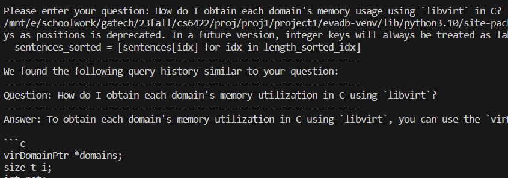
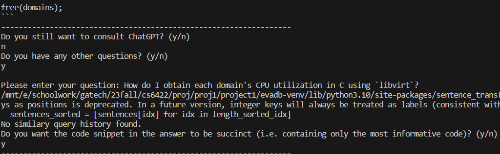
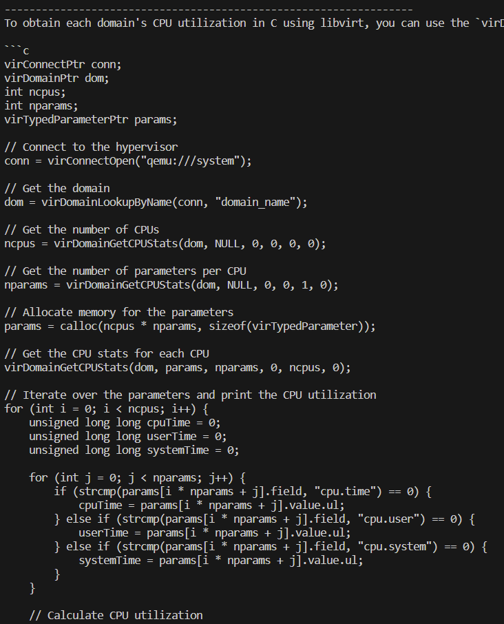

# EvaDB + Llamaindex Programming Helper Bot

This is a simple `libvirt` programming helper bot that features concise example code snippets & simple query reuse, implemented using EvaDB and Llamaindex.

An example usecase is given below:

